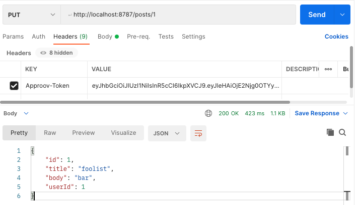
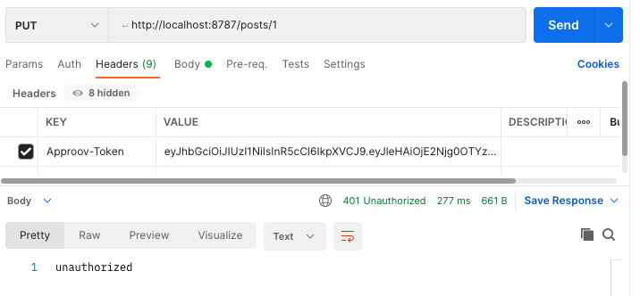

# Approov Quickstart - Cloudflare Worker

[Approov](https://approov.io) is an API security solution used to verify that requests received by your backend services originate from trusted versions of your mobile apps.

This repo implements the Approov server-side request verification code in a Cloudflare worker which performs the verification check before forwarding valid traffic through to the target API.

NOTE: this quickstart uses a `wrangler2` Cloudflare worker implementation.

## Why Approov?

You can learn more about Approov, the motives for adopting it, and more detail on how it works by following this [link](https://approov.io/approov-in-detail.html). In brief, Approov:

* Ensures that accesses to your API come from official versions of your apps; it blocks accesses from republished, modified, or tampered versions
* Protects the sensitive data behind your API; it prevents direct API abuse from bots or scripts scraping data and other malicious activity
* Secures the communication channel between your app and your API with [Approov Dynamic Certificate Pinning](https://approov.io/docs/latest/approov-usage-documentation/#approov-dynamic-pinning). This has all the benefits of traditional pinning but without the drawbacks
* Removes the need for an API key in the mobile app
* Improves the network layer DDoS protection provided by Clouflare with an application layer provided by Approov

## Verifying Approov Through a Serverless Gateway

The Approov Gateway is implemented as a Cloudflare worker and protects a backend API service from unauthorized access.

Each API call to the gateway contains an Approov JWT token, typically passed as an `Approov-Token` header value. A token is signed by a secret known only to the Approov cloud service and the Approov Cloudflare worker. The Cloudflare worker verifies that the Approov token has not expired and is properly signed.

Optionally, an Approov token can be bound to another header value, typically a bearer authorization header. A hash of this header value is compared to a pay claim in the Approov token to ensure they match.

If the Approov verification succeeds, the API call is rewritten and forwarded to the backend API service, and the service's response is returned to the original caller. If the token is missing or fails verification, a 401 unauthorized response is immediately returned to the caller.

See [Approov in Detail](https://approov.io/product) for additional information on how the mobile app and backend fit together with the Approov cloud service and the Approov SDK.

### CAUTION

This Cloudflare worker implementation is based on the `wrangler2` development tooling. The runtime is built around the V8 Javascript engine and implements browser APIs but does not offer all node built-in services. As a result, the [@tsndr/cloudflare-worker-jwt](https://www.npmjs.com/package/@tsndr/cloudflare-worker-jwt) is used to verify JWTs. This library works best with secret strings which only contain printable characters. For Approov, this requires the account secret to contain only printable characters. Use the following CLI command to set this:

```
> approov secret -change -forcePrintable
```

See [Raw Account Secret Key](https://approov.io/docs/latest/approov-usage-documentation/#raw-account-secret-key) for more information.

## Setting up Approov Verification in Cloudflare

### 0. Setup Your Approov and Cloudflare Environments

These instructions assume you have a working `node` and `npm` development environment.

An Approov account and properly installed Approov CLI are required. If necessary, request an [Approov free trial](https://approov.io/signup). Once the form is completed, your will receive instructions about activating your account and installing the CLI.

A Cloudflare account and wrangler CLI are also required. Go to [Cloudflare Workers](https://workers.cloudflare.com/) and sign up or log in as appropriate. Install the  latest wrangler CLI:

```
> npm install -g wrangler
```

During the setup, the free [{JSON} Placeholder](https://jsonplaceholder.typicode.com) fake API is used as an example backend API service.

The quickstart is initially configured to use your free `*.<CF_SUBDOMAIN>.workers.dev` domain, but this can be customized later in your `wrangler.toml` file and Cloudflare worker's dashboard.

See additional information at [Cloudflare Docs](https://developers.cloudflare.com/workers/).

This initial setup assumes default values for all environmental variables. The default setup verifies the liveness and signature of the Approov token. No additional token binding check is used. The token is taken from the `Approov-Token` header.

### 1. Clone and Install the Cloudflare Approov Worker Quickstart

```
> git clone https://github.com/approov/quickstart-cloudflare_approov-worker.git
> cd quickstart-cloudflare_approov-worker
> git checkout wrangler2
> npm install
```

Make sure you switched to the `wrangler2` branch before installing the project files.

### 2. Log In to Wrangler

Make sure you are in the `quickstart-cloudflare_approov-worker` directory and run:

```
> wrangler login
```

A default browser window will open asking for authorization.

### 3. Add the Gateway API Domain to Approov

The Approov Cloudflare worker is initially published to `approov-gateway.<CF_SUBDOMAIN>.workers.dev` domain. Replace `<CF_SUBDOMAIN>.workers.dev` with the subdomain you have configured in your cloudflare dashboard:

```
> approov api -add approov-gateway.<CF_SUBDOMAIN>.workers.dev
```

### 4. Setup Your Approov Secret

IMPORTANT: because of limitations in the cloudflare worker JWT verifier, your account secret must contain only printable characters. Force Approov to provide a printable secret, and then get that secret in base64 format:

```
> approov secret -change -forcePrintable
> approov secret -get base64
```

Copy the resulting base64 secret string, and add it to your wrangler environment:

```
> wrangler secret put APPROOV_SECRET_BASE64
```

When asked, paste in the base64 secret string.

### 5. Specify your API Service Domain

Next, add the domain of your backend API service to the wrangler environment. As an example, we will use the {JSON} Placeholder API - `jsonplaceholder.typicode.com`:

```
> wrangler secret put API_DOMAIN
```

When asked, input `jsonplaceholder.typicode.com` or your own API domain.

NOTE: the target API domain can be any internet-accessible domain. It is not restricted to registered Cloudflare domains, though an advanced setup might bind the API domain to the cloudflare worker. See [service bindings](https://developers.cloudflare.com/workers/runtime-apis/service-bindings/) for more information.

### 6. Generate Approov Example Tokens

For testing, generate a valid example Approov token:

```
> approov token -genExample approov-gateway.<CF_SUBDOMAIN>.workers.dev
```

and an invalid Approov token:

```
> approov token -genExample approov-gateway.<CF_SUBDOMAIN>.workers.dev -type invalid
```

Save both tokens for testing.

NOTE: the valid Approov token expires in 2 hours, so you will need to generate a new valid token every 2 hours.

You can check the token's expiration date by pasting the token into {jwt.io}[https://jwt.io] and hovering over the `exp` value in the payload claims. You do not need a valid signature to see the claims.

### 7. Test Your Cloudflare Worker Locally

Make sure you are in the `quickstart-cloudflare_approov-worker` directory and run:

```
> wrangler dev
```

If successful, a local cloudflare worker will be running at `http://localhost:8787`

Use a tool like [Postman](https://www.postman.com/) to test your local worker.

For example, create a resource at `jsonplaceholder.typicode.com` update a post resource using a `PUT` method to the `/posts/1` endpoint. To succeed, make sure you add the **valid** Approov token to the `Approov-Token` header value:



Repeat this call, but change the `Approov-Token` header value to the **invalid** Approov token:



### 8. Publish Your Approov Gateway

When ready, publish your Approov gateway to to Cloudflare:

```
> wrangler publish
```

The API Gateway is now available at `approov-gateway.<CF_SUBDOMAIN>.workers.dev`.

You can test this production version in Postman by replacing `localhost:8787` with `approov-gateway.<CF_SUBDOMAIN>.workers.dev`.

From here, you can switch to a custom domain and add any additional processing or logging withing the `src/index.js` file.

### Changing the Wrangler Configuration

Cloudflare workers are configured using the `wrangler.toml` file. The default configuration includes a `[vars]` section which can change the verification setup:

```
[vars]

# Name of header field holding Approov token
#   default is "Approov-Token"
#APPROOV_TOKEN_HEADER_NAME = "Approov-Token"

# Name of header field holding binding value
#   default is "Authorization"
#APPROOV_BINDING_HEADER_NAME = "Authorization"

# Approov verification strategy ("token" or "token-with-binding")
#   default is "token"
#APPROOV_VERIFICATION_STRATEGY = "token-with-binding"
```

Default values are shown. To change any setting, uncomment its assignment and update its value.

Note: you must restart your Cloudflare worker after making any changes to the `wrangler.toml` configuration before these changes will take effect.

### Adding Approov Token Binding Checks

The `APPROOV_VERIFICATION_STRATEGY` defaults to `token` check only. To add a binding check, uncomment and change the `APPROOV_VERIFICATION_STRATEGY` value to `token-binding`.

By default, the `Authorization` header field is assumed to contain the binding value. To change which header field holds the binding value, uncomment `APPROOV_BINDING_HEADER_NAME` and update its value to be the name of the header field holding the value being bound.

A token is properly bound if a hash of the binding value matches the value found in the `pay` claim within the Approov token.

For testing, add a data value to be hashed into an example Approov token:

```
> approov token -genExample approov-gateway.<CF_SUBDOMAIN>.workers.dev -setDataHashInToken 'Bearer 0123456789abcdef'
```

In this case, the example data value is `Bearer 0123456789abcdef`. Add that same data value to the `APPROOV_BINDING_HEADER_NAME` field in any API call being validated by an Approov token-binding check.

Don't forget to restart your Cloudflare worker after making any changes to the `wrangler.toml` configuration.

See [Approov Token Binding](https://approov.io/docs/latest/approov-usage-documentation/#token-binding) for important information on Approov token binding checks.

## Useful Links

### Cloudflare

#### Development

* [Getting Started](https://developers.cloudflare.com/workers/)
* [Debugging Workers](https://developers.cloudflare.com/workers/learning/debugging-workers/)

#### Logs

* [Tail logs with the wrangler cli](https://developers.cloudflare.com/workers/tooling/wrangler/commands/#tail)
* [Cloudflare Logs for Enterprise Customers](https://www.cloudflare.com/products/cloudflare-logs/)
* [Log to ElasticSearch](https://blog.cloudflare.com/logs-from-the-edge/)
* [Log to Sentry](https://blog.cloudflare.com/dogfooding-edge-workers/)
* [Log to LogDNA](https://community.cloudflare.com/t/simple-log-collector-worker/40954)

---
